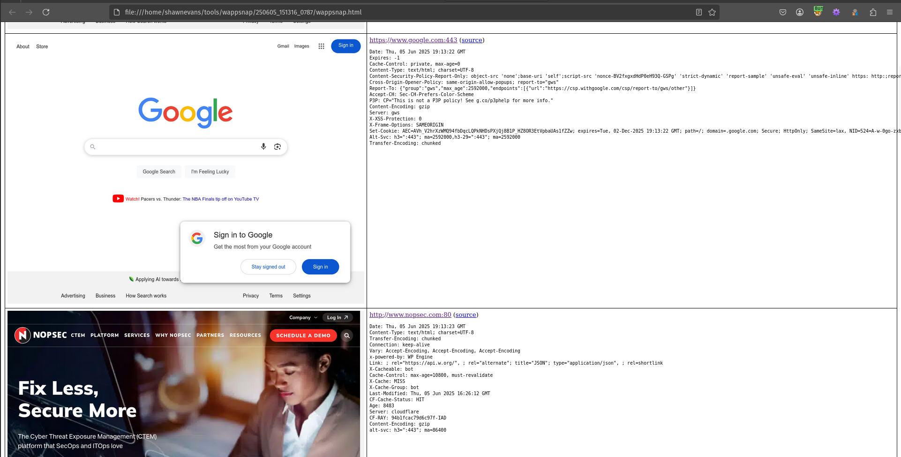

# WappSnap

WappSnap is a handy web application screen shot utility. It can ingest Nessus/Nmap XML, flat text files, or a single URL on the command line. 


> **Note**
> WappSnap was inspired by and based upon PeepingTom. I relied on PeepingTom for many years. Out of necessicity I had to make my own updates to keep it working. Over time these changes resulted in a tool that deserved its own repo. It would not be here without PeepingTom.
>
> OG: https://bitbucket.org/LaNMaSteR53/peepingtom/
> Thanks @LaNMaSteR53

## Installation

```bash
$ git clone https://github.com/ShawnDEvans/wappsnap
$ cd wappsnap
$ python3 -m pip install -r requirements.txt
$ ./wappsnap.py -h
...
```

## Features:
- Extract targets from Nessus and Nmap
- Flat text files
- Generates an HTML report

## Plans:
- Add a JSON output option 
- Add option to change output resolution

## Help
```
$ ./wappsnap.py -h
usage: wappsnap.py [-h] (-u URL | -f FILE | --nmap NMAP) [--proxy PROXY] [--network-timeout NETWORK_TIMEOUT]
                   [--wait-time WAIT_TIME] [--render-delay RENDER_DELAY] [-v] [--browser {chrome,firefox}] [--threads THREADS]

WappSnap: A multi-threaded tool to capture screenshots of web servers.

options:
  -h, --help            show this help message and exit
  -u URL, --url URL     Single URL to capture (e.g., http://example.com).
  -f FILE, --file FILE  Path to a text file containing URLs (one per line).
  --nmap NMAP           Path to an Nmap XML file to extract HTTP/HTTPS endpoints.
  --proxy PROXY         Specify a proxy server (e.g., http://127.0.0.1:8080 or socks5://127.0.0.1:9050). Default: No proxy.
  --network-timeout NETWORK_TIMEOUT
                        Maximum seconds to wait for initial HTTP connection/headers (default: 10).
  --wait-time WAIT_TIME
                        Maximum seconds to wait for a page to load/render (default: 15).
  --render-delay RENDER_DELAY
                        Fixed time (in seconds) to wait after loading, guaranteeing rendering (default: 1.0).
  -v, --verbose         Increase output verbosity, showing all target URLs and per-request status.
  --browser {chrome,firefox}
                        Specify the WebDriver browser to use (default: chrome).
  --threads THREADS     Number of threads to use (default: 8).
```

## Example Output
```
$ ./wappsnap.py --file test.txt -v
[*] Found 4 unique URLs to process.

--- Target URL List ---
https://www.amazon.com
https://www.linkedin.com
https://www.google.com
https://www.microsoft.com
-----------------------

[*] Initializing 8 WebDriver instances...
[*] Report files will be saved in: reports/WappSnap_Run_20251203_151916
[+] https://www.google.com -> SUCCESS (200)                                                                             
[+] https://www.linkedin.com -> SUCCESS (200)                                                                           
[+] https://www.amazon.com -> SUCCESS (503)                                                                             
[+] https://www.microsoft.com -> SUCCESS (200)                                                                          
[*] ⏳ Processing: Total: 4 | Completed: 4 | Failed: 0
[*] Cleaning up WebDriver pool...

[+] HTML report generated successfully at reports/WappSnap_Run_20251203_151916/report.html

[*] Total execution time: 11.06 seconds.

```

## HTML Report:



